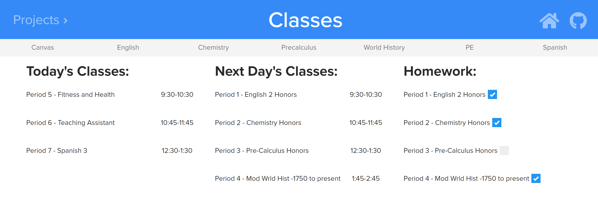

# nathangong.github.io
This is a website where I keep all my projects. This home page is still under development and isn't complete yet.

## Classes
This is a site where I can keep track of all my classes and homework for the next day. It uses cookies to store the homework completion status and also the Microsoft Calendar API to receive data about what classes I have for each day. (Only works with BCP emails)

Here is an exmaple of what it would look like for people who do have a BCP email:
<kbd></kbd>
